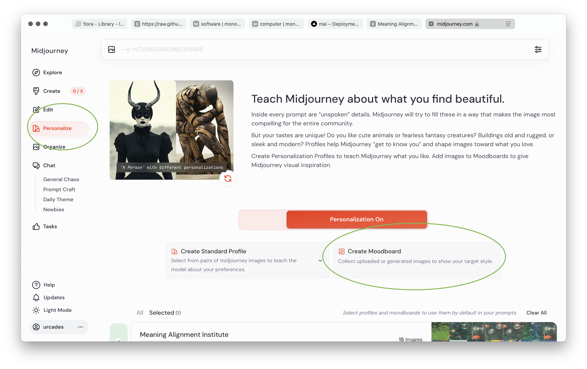
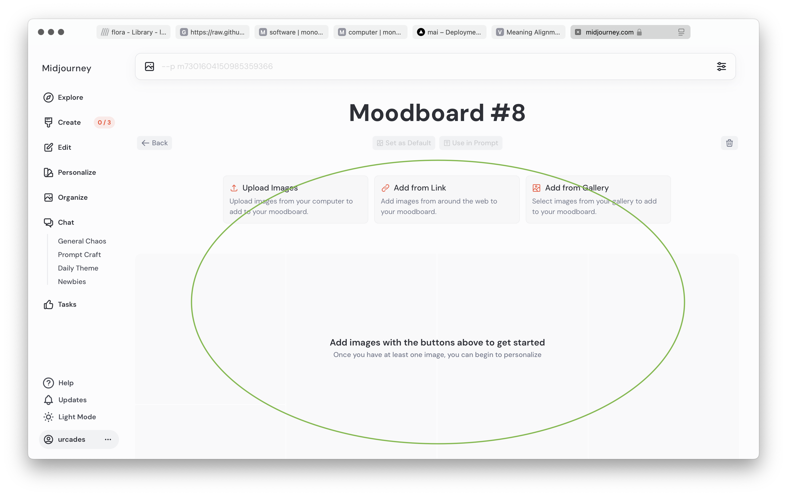
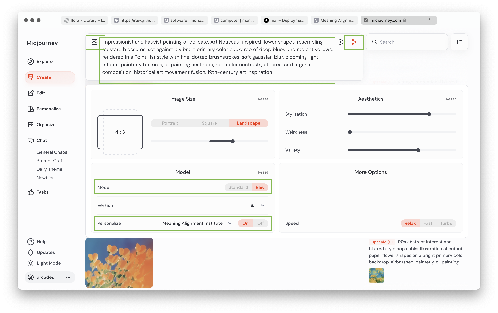
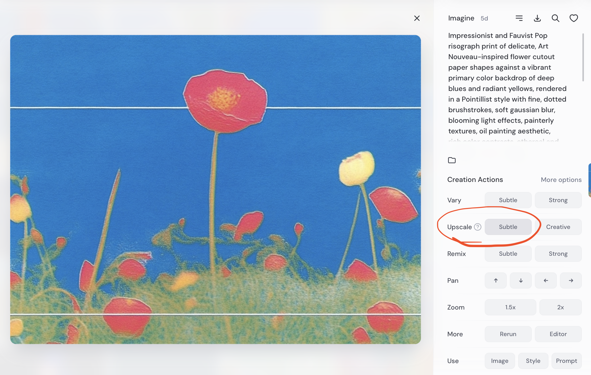

## Image Generation for Blog Posts

Set up a midjourney account if you don't already have one



Navigate over to the "Personalize" tab, and click "Create Moodboard"



Drag in any interesting reference imagery you'd like to train your overall look and feel on. I'd recommend selecting as many images as you can find, so the model can produce specific results.

Once you've populated a moodboard as you see fit, click "Create".



In the text input at the top of the screen, compose a prompt that hones in on what you want to produce. If you're stuck, use Claude or Grok or another foundation model to come up with a midjourney image generation prompt that approximates what you want to see. Always be specific with your references, use artist's names, mention periods of time you appreciate, or rough aesthetics you don't know the name of. Any detail helps.

This is an example of a prompt I roughed out for this project with the help of Grok:

```
Impressionist and Fauvist painting of delicate, Art Nouveau-inspired flower shapes, resembling mustard blossoms, set against a vibrant primary color backdrop of deep blues and radiant yellows, rendered in a Pointillist style with fine, dotted brushstrokes, soft gaussian blur, blooming light effects, painterly textures, oil painting aesthetic, rich color contrasts, ethereal and organic composition, historical art movement fusion, 19th-century art inspiration
```

Click the sliders icon in the text prompt at any point and set "Mode" to "Raw", and ensure that the "Personalization" field is set to your moodboard. Set the other options to whatever you think seems interesting

If you want the model to hone in on a very specific image from your moodboard to use as a reference, click the leftmost picture icon, which shows all of the images you've added to moodboards you've created. Click whatever image you want to specifically reference.

Generate!

Each generation produces 4 image iterations. Depending on what you set the "Variety" slider to, they'll either be very similar, or very different from one another.


If you see a generation you want to try again, click "Rerun"


If you see any of the generated images you really like, and want to see similar iterations of, click "Vary Subtle".

If you want to see generations that are broadly what you want, but not yet there, click "Vary Strong".

You might end up repeating the "Vary" process quite a bit before you find something you like.



When you finally see a generation you've produced that you want to make high-res, click "Upscale Subtle". This will produce a single high quality image you can download to edit further in a program of your choice.

## Post-editing

You can use whatever you want to edit these photos, but to obtain the general look and feel of what I was producing, just add "Diffuse" noise to the image, which scatters its pixels around in a fuzzy way that I think is pretty pleasant. Adjust colors to get the look/feel you want for the website. Saturated primary colors feel good for the most part, or green/blue earthy tones. As a final step, you can apply 33% or so of monochromatic noise to the image to soften it a bit.
